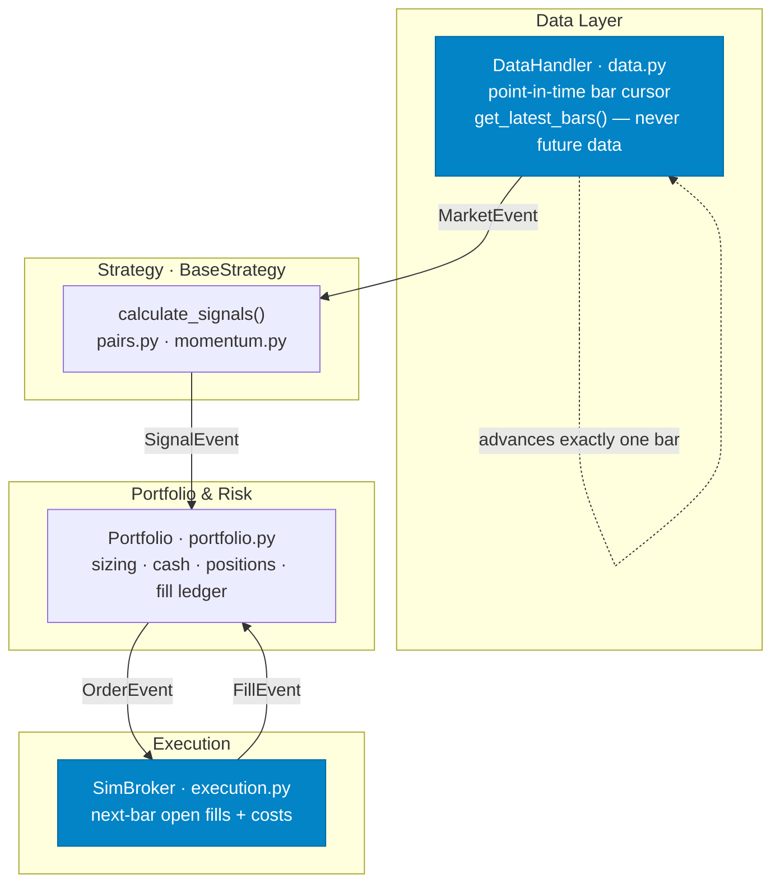
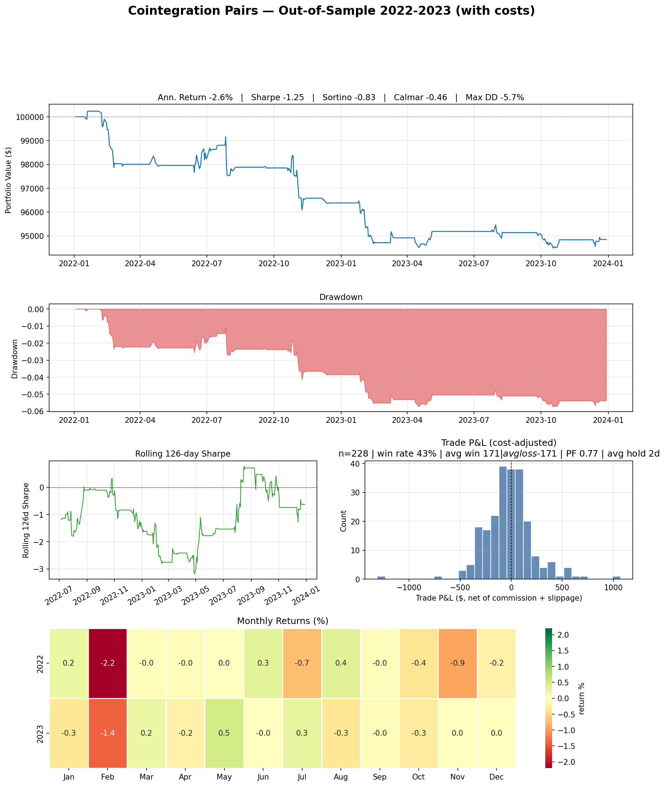

# 📉 Event-Driven Backtesting Engine

<div align="center">

[](https://www.python.org/)
[](https://pandas.pydata.org/)
[](https://numpy.org/)
[](https://www.statsmodels.org/)
[](https://jupyter.org/)
[](tests/)
[](LICENSE)
[](#-results--out-of-sample)

</div>

**A reusable, strategy-agnostic event-driven backtesting engine that prevents look-ahead bias *structurally* — not by convention.** It pairs a one-bar-at-a-time event loop with next-bar fills, realistic transaction costs, two-stage held-out pair validation, and 15-window walk-forward analysis. Two completely different strategies (cointegration pairs trading and cross-sectional momentum) plug into the **same unchanged engine core**.

The headline result is **negative — and reported in full.** That is the entire point: a pipeline that can only ever produce good-looking numbers is a curve-fitting machine, not a backtest. This repo is engineered to measure a strategy honestly, including when the strategy loses.

---

## 🎯 The Thesis

Most retail backtests quietly leak the future: one stray array index, a fill at a price you already observed, a parameter swept until the equity curve smiles. This engine is built so those mistakes are **impossible by construction**, then used to put a textbook statistical-arbitrage strategy through an honest gauntlet:

- **Structural look-ahead guards** — the strategy can only ever see bars that have already elapsed.
- **Costed, next-bar execution** — you trade tomorrow's open, minus commission and slippage.
- **Held-out validation** — pairs must re-qualify on data the discovery step never saw.
- **No flattering knobs** — the sensitivity grid is smooth and uniformly negative; nothing was tuned to the headline.

> [!IMPORTANT]
> **Out-of-sample, net of costs, the strategy is unviable (Sharpe ≈ −1.25).** Gross of costs it is roughly flat. Commission and slippage are the headline. Reporting that — rather than burying it — is the deliverable.

---

## 🏗️ Core Architecture

A classic event-driven loop. Components communicate **only** through a shared event queue; none of them reaches into another's state. The core modules never know which strategy is running — a new strategy is the *only* moving part.



```
DataHandler → MarketEvent → Strategy → SignalEvent →
Portfolio → OrderEvent → SimBroker → FillEvent → Portfolio
```

The loop lives in `run.py::run_backtest`. The engine core (`data.py`, `execution.py`, `portfolio.py`, `queue.py`, `events.py`) is strategy-agnostic.

### Two structural guards eliminate look-ahead

1. **Point-in-time bars.** `DataHandler.get_latest_bars(symbol, N)` returns only rows `[cursor−N : cursor]`. Asking for 100 bars when 5 have elapsed returns 5. Future data does not exist in the slice.
2. **Next-bar fills.** `SimBroker` fills every order at the *following* bar's open. You cannot trade on a price you just observed.

All prices use `yfinance auto_adjust=True` (split/dividend-adjusted), so corporate actions don't manufacture false cointegration signals.

---

## 🧩 Strategy Plug-in Architecture

A strategy subclasses `BaseStrategy`, reads bars through the point-in-time API, and emits `SignalEvent`s. The engine handles sizing, fills, costs, and accounting:

```python
from backtester.strategy import BaseStrategy
from backtester.events import SignalEvent, SignalDirection
from run import run_backtest

class MyStrategy(BaseStrategy):
    def calculate_signals(self):
        bars = self.data.get_latest_bars("AAPL", 20)          # never future data
        if bars is not None and len(bars) == 20:
            self.queue.put(SignalEvent("AAPL", SignalDirection.LONG))  # Portfolio sizes it

equity = run_backtest(["AAPL"], "2022-01-01", "2023-12-31", strategy_cls=MyStrategy)
```

Two strategies ship as proof the architecture is genuinely generic:

| Strategy | File | Shape | Engine changes |
|---|---|---|---|
| **Cointegration pairs** | `strategies/pairs.py` | two-leg, mean-reverting, event-triggered, hedge-ratio sized | none |
| **Cross-sectional momentum** | `strategies/momentum.py` | single-leg, long-only, monthly-rebalancing, multi-position | **none** |

The momentum strategy is a *completely different shape* — yet it required **zero** changes to the engine core. That is the plug-in architecture working.

---

## 🔬 Statistical Methodology

### Pair discovery — point-in-time, two-stage

- Universe: ~25 liquid S&P 500 names (Tech + Financials) for the primary study; extended to **four sectors** (adding Energy + Utilities, ~45 names) for the sector comparison.
- **Within-sector pairs only.** Sectors are never pooled — this rule extends unchanged to the new sectors. All statistics run on **log prices** (scale-free, stabler across price levels).
- **Two-stage screen:**
  1. Engle–Granger at `p < 0.05` on the training window *minus its final 3 months*.
  2. **Held-out requalification:** survivors must also pass Engle–Granger at `p < 0.10` on those final 3 months, which the screen never saw.
- **Why not Bonferroni?** With 144 dependent tests the threshold collapses to `p < 0.000347`; on COVID-era data *zero* pairs pass and the strategy never trades. Pair tests share symbols and are strongly dependent, so Bonferroni over-corrects. The held-out stage is the multiple-testing control instead: joint false-positive probability per pair ≈ `0.05 × 0.10 = 0.005` (~0.7 expected false positives across 144 tests — stricter than a naïve `p < 0.05` screen).
- **Discovery is point-in-time.** The screen runs *inside* the event loop on the bar the training window closes, reading bars only through `get_latest_bars`, so it structurally cannot touch post-training data.

### Signal & sizing

- Spread `Sₜ = log(Pₐ) − β·log(P_b)`, β the OLS hedge ratio in log space.
- Rolling 60-day z-score; **entry** `|z| > 2.0`, **exit** `|z| < 0.5`.
- **Stop-out** when rolling 60-day cointegration `p > 0.1` (the relationship has broken).
- **Hedge-ratio sizing:** `q_b = C·β / P_b` shares — the exact dollar-neutral hedge for a log spread. Equal-dollar sizing leaves residual directional exposure when β ≠ 1.
- **Exits unwind exact entry quantities** so pairs that share a leg can't corrupt each other's positions.

### Transaction costs

Commission **$0.001/share** (IB-style) and **5 bps** slippage on every fill. All reported results include costs; the notebook also runs cost-free to isolate cost drag.

---

## 📊 Results — Out-of-Sample

Pairs discovered on 2019–2021 training data; everything below is measured on the **2022–2023 holdout the discovery step never saw**. Full tearsheet, walk-forward table, and sensitivity grid in [`notebooks/research.ipynb`](notebooks/research.ipynb).

Discovered pairs: `META/AVGO`, `META/TXN`, `BAC/PNC`, `AXP/PNC`.



| Metric (out-of-sample) | Value |
|---|---|
| Sharpe (with costs) | **−1.25** |
| Sharpe (without costs) | −0.02 |
| Cost drag | 1.23 Sharpe points |
| Sortino (with costs) | −0.84 |
| Max drawdown | −5.7% |
| Annualized return | −2.6% |
| Walk-forward windows | 15 (9 traded; mean Sharpe across traded windows 0.08) |

**The result is negative, and we report it anyway — that is the point.** Gross of costs the strategy is flat; commission and slippage make it clearly unviable. The stop-out rule limits losses from broken pairs but generates churn the cost model punishes. The sensitivity grid is smooth and uniformly negative, so this is not an artifact of one threshold choice — and no parameter was tuned to flatter the headline.

---

## 🧭 Sector Results

Each sector runs **independently** through the full pipeline (within-sector discovery at the 2021-12-31 split, traded over the 2022–2023 holdout, costs on). Sectors are never pooled. Per-window walk-forward in the notebook (Section 10).

| Sector | Cost-adj. Sharpe | Cost drag | Max drawdown | Ann. return |
|---|---|---|---|---|
| Tech | −0.79 | 0.77 | −3.4% | −1.5% |
| Financials | −1.29 | 1.28 | −2.8% | −1.2% |
| Energy | 0.00 ¹ | 0.00 | 0.0% | 0.0% |
| Utilities | 0.00 ¹ | 0.00 | 0.0% | 0.0% |

¹ *No within-sector pairs passed the two-stage screen at the headline split, so these sectors never traded that window.*

**The low-volatility hypothesis (Utilities/Energy → lower turnover → smaller cost drag) does not hold cleanly.** In the 2022–2023 headline window the screen found **no qualifying within-sector pairs** in Energy or Utilities — zero turnover and zero cost drag, but also zero signal, which is *absence of cointegration*, not efficient low-vol trading. Across the full walk-forward they **do** trade in other windows and their mean traded-window Sharpe is negative (Energy ≈ −1.23, Utilities ≈ −0.60), no better than Tech or Financials.

> [!NOTE]
> **A live survivorship-bias artifact.** The Energy list specifies Pioneer Natural Resources (**PXD**), a valid 2019–2023 constituent. It is no longer downloadable via `yfinance` because ExxonMobil acquired and delisted it in 2024. The notebook drops it at runtime and reports the drop — exactly the bias documented below, caught in the wild.

### A second strategy, side-by-side (Tech, OOS 2022–2023)

| Metric | Momentum | Pairs |
|---|---|---|
| Sharpe | 0.50 | −0.79 |
| Calmar | 0.30 | −0.43 |
| Max drawdown | **−45.6%** | −3.4% |
| Ann. return | 13.7% | −1.5% |

Momentum posts a *positive* Sharpe but a brutal drawdown — a concentrated long-only book straight through the 2022 tech sell-off. A positive Sharpe with a ~45% drawdown is not a good strategy; it is an undiversified long that happened to recover. The point isn't that momentum wins — it's that a structurally different strategy produced coherent, fully-costed, honestly-reported numbers on the **unchanged engine**.

---

## ⚖️ Honest Limitations

1. **Survivorship bias — partially mitigated.** Sector lists are drawn from *today's* index membership, silently excluding names delisted during the period. `backtester/universe.py::get_point_in_time_universe(sector, as_of_date)` intersects each list with the actual S&P 500 constituents on the as-of date, via the public [fja05680/sp500](https://github.com/fja05680/sp500) history (downloaded at setup; graceful fallback + warning if unavailable).
   - **Fixes:** trading names *before* they joined the index. As of 2019-01-01 the check drops **META** from Tech (the ticker was "FB" until the 2022 rename) and **TFC** from Financials (Truist was formed by the BB&T/SunTrust merger in Dec 2019); TFC re-enters by 2021.
   - **Does not fix:** long-dead tickers that never made it into our curated lists (e.g. PXD post-delisting). A full fix needs a point-in-time constituent **and sector** database such as Compustat / CRSP.

2. **Regime dependence — documented.** Pairs strategies bleed in trending regimes. Across the combined walk-forward (15 windows, 9 traded, mean Sharpe 0.08) the worst windows were **2023-04 → 2023-07 (Sharpe −1.70)** and **2021-01 → 2021-04 (−1.43)**; the best was **2022-07 → 2022-10 (+2.08)**. That ≈3.8-Sharpe spread *is* the regime dependence. Several pairs include META, whose 2022 collapse broke its cointegrating relationships outright.

3. **Capacity.** Liquid large-caps at modest size. Real institutional capacity is bounded by market impact, which this model does not simulate.

---

## 🚀 Quickstart

```bash
pip install -r requirements.txt
jupyter notebook notebooks/research.ipynb
# Kernel → Restart & Run All
```

The notebook runs top-to-bottom: pair discovery, OOS validation, cost drag, extended tearsheet (Calmar, monthly-returns heatmap, trade-level analysis), the four-sector study, a 4-sector cost-sensitivity grid, and the momentum comparison.

## 🧪 Tests

```bash
pytest tests/ -v          # 85 tests
```

Covers look-ahead prevention, two-stage screening, signal logic, walk-forward windowing, the point-in-time universe loader, momentum signal generation, and the tearsheet metrics (Calmar, monthly table, trade reconstruction).

## 📦 Project Structure

```
backtester/      # engine core — data, events, queue, portfolio, execution, metrics, tearsheet, universe
strategies/      # pairs.py · momentum.py  (subclass BaseStrategy)
notebooks/       # research.ipynb — the full study
tests/           # 85 pytest tests
run.py           # the event loop (run_backtest)
```

## 📄 License

MIT — see [LICENSE](LICENSE).
